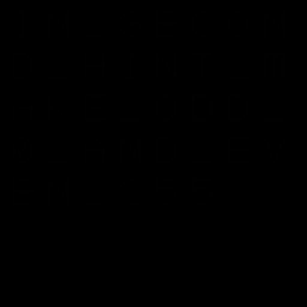
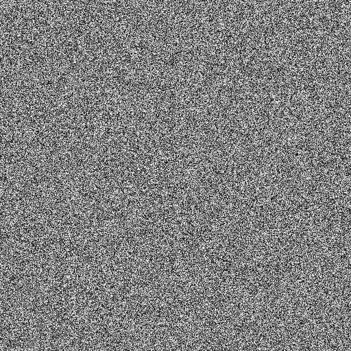
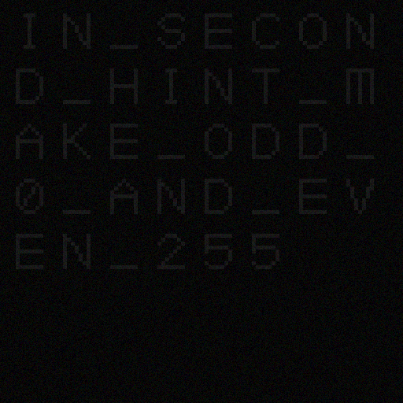
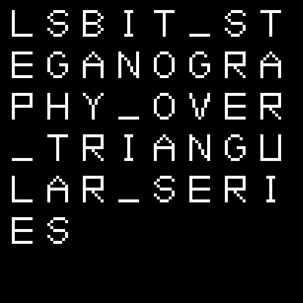

# Beat the map

---

In this challenge we have an 2 hints and a challenge, all of the assets are in bmp format.

##### The message:

> We got these images with a secret message from one of our agents, but we have no clue where the flag is hiding.
> Can you assist?

##### The assets:

Challenge:


First hint:


Second hint:


##### Solution

###### First hint

By reading the message, we knew it is steganography challenge

We solved first hint by using a sample of code from the internet of decrypting an img, and also solved it using online tools

first_hint.bmp hidden message:

```
IN_SECOND_HINT_MAKE_ODD_0_AND_EVEN_255
```

Photo:


###### Second hint

Followed by the instruction of the first hint solution, we changed every odd pixel to [0,0,0] and every even to [255,255,255]

second_hint.bmp hidden message:

```
LSBIT_STEGANOGRAPHY_OVER_TRIANGULAR_SERIES
```

Photo:


###### Challenge

LSBIT means least significant bit

We read only least significant bits that are on triangular series.

Notice: You have to transpose the img, or iterate it backwards, as y axis is flipped on images.

Sample of our result:

```
>>>>>CSA{lEn4_Y0u_aLm0st_fO0l3d_mE}<<<<<>>>>>CSA{lEn4_Y0u_aLm0st_fO0l3d_mE}<<<<<>>>>>CSA{l
```

##### Flag:

Flag is also a reference to the famous lena img, which is standard img test for image processing

```
CSA{lEn4_Y0u_aLm0st_fO0l3d_mE}
```
