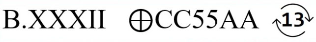

# D3c0d3Me

---


In this challenge we have to decode the message to acheive the flag.

##### The message

```
WFKZLTABVKWVLXGMASVPYVP2ZRTKVHKV6XGBJKVEKX44YCVKXBK4XTBDVKSVL2WMACVLOVPEZQJ2VHCV
```

##### The clue



##### Solution

By reading the clue, we notice there are 3 parts:

- B.XXXII
- &oplus;CC55AA
- &circlearrowright;13

Each one of them represents a encryption/encoding technique

- B.XXXII - Base32 decoding
- &oplus;CC55AA - Bitwise operation XOR (a^b), b represents the string - `CC55AA`
- &circlearrowright;13 - ROT13 cipher

After all of those operation we receive:

```
}?GniD0C3D_NuF_gniv@H{ASC
```

Which means we are not done yet and we have to reverse the string.

To sum up,

Base32 decode &rarr; XOR with `CC55AA` &rarr; ROT13 &rarr; Reverse

---

##### Flag:

```
CSA{H@ving_FuN_D3C0DinG?}
```
