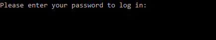

# Pass it on

---

In this challenge we have an executable file and a clue

##### The exec:



##### The clue:

> He is very secretive and will not elaborate, but I have heard him complain several times about how long it takes the program to verify his password. Weird right?
- The riddle says that the password begins with CSA

##### Solution

By reading the clue, we thought about the sentences that says
> how long it take the program to verify his password. 

We tryed few random inputs on the exec, and noticed that: 
- It is immediatly response with wrong password 

Currently we know: 
- Time is an issue
- We need to find the length of the correct input

We used brute force to find out the the correct length of the password using the timing attack.
Used CSA prefix and the letter a * x times.

- We found out that the password length is `27`

Plan: 

We performing a timing attack each letter at a time using String.printable letters starting with CSA prefix and a letter * 24 `CSAaaaaaaaaaaaaaaaaaaaaaaaa`
- Send each asci letter and measure the response time
- If the response time is greater then max response time - we save this letter
- At the end of each iteration we append the current saved asci char to the password and move to the next letter on the password
 

Output: 
```
b'Please enter your password to log in:\r\n'
CSA{aaaaaaaaaaaaaaaaaaaaaaa 3
CSA{1aaaaaaaaaaaaaaaaaaaaaa 4
CSA{1_aaaaaaaaaaaaaaaaaaaaa 5
CSA{1_Vaaaaaaaaaaaaaaaaaaaa 6
CSA{1_V1aaaaaaaaaaaaaaaaaaa 7
CSA{1_V1Laaaaaaaaaaaaaaaaaa 8
CSA{1_V1LLaaaaaaaaaaaaaaaaa 9
CSA{1_V1LL_aaaaaaaaaaaaaaaa 10
CSA{1_V1LL_maaaaaaaaaaaaaaa 11
CSA{1_V1LL_meaaaaaaaaaaaaaa 12
CSA{1_V1LL_me5aaaaaaaaaaaaa 13
CSA{1_V1LL_me55aaaaaaaaaaaa 14
CSA{1_V1LL_me55_aaaaaaaaaaa 15
CSA{1_V1LL_me55_waaaaaaaaaa 16
CSA{1_V1LL_me55_w1aaaaaaaaa 17
CSA{1_V1LL_me55_w1Taaaaaaaa 18
CSA{1_V1LL_me55_w1Thaaaaaaa 19
CSA{1_V1LL_me55_w1Th_aaaaaa 20
CSA{1_V1LL_me55_w1Th_taaaaa 21
CSA{1_V1LL_me55_w1Th_t1aaaa 22
CSA{1_V1LL_me55_w1Th_t1maaa 23
CSA{1_V1LL_me55_w1Th_t1mEaa 24
CSA{1_V1LL_me55_w1Th_t1mE!a 25
CSA{1_V1LL_me55_w1Th_t1mE!Y 26  # a bug, but i know } has to be the end.
```
##### Flag:

```
CSA{1_V1LL_me55_w1Th_t1mE!}
```
